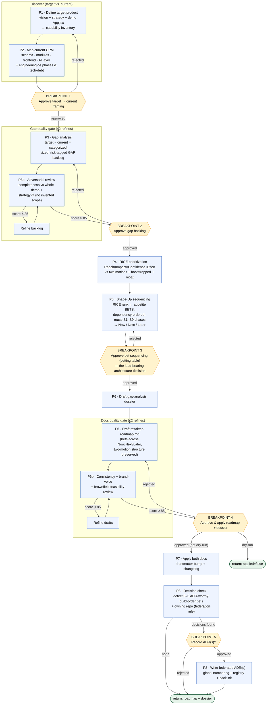

# product-refactor-roadmap — flow diagram

## Legend

- **Rounded amber** = human breakpoints (5 total: 3 phase gates + 1 final apply gate + 1 ADR gate).
- **Blue** = agent tasks (`general-purpose`).
- **Two refine loops** (gap backlog, drafts) each capped at 2 iterations, gated at score ≥ 85.
- Every task writes to `artifacts/<effectId>-*.md`; the canonical docs are touched only after **Breakpoint 4**.
